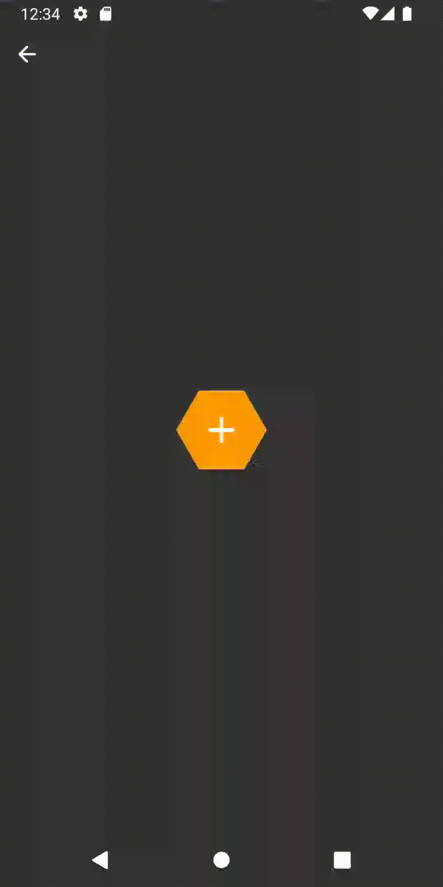
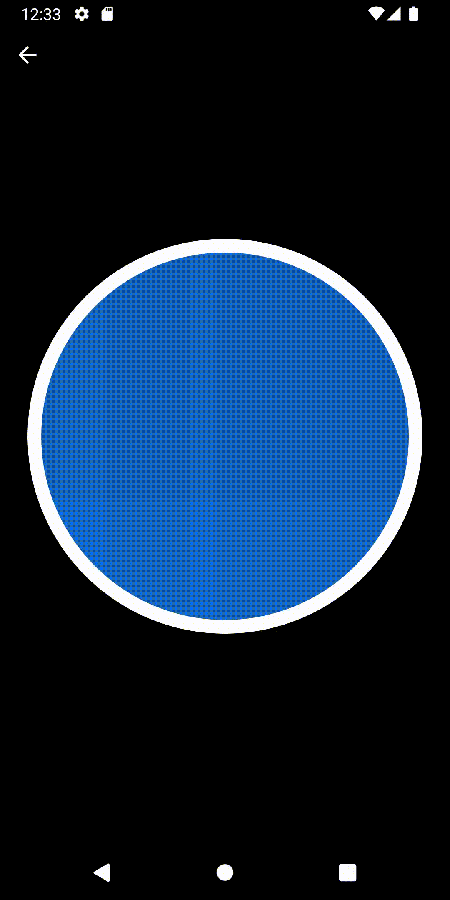
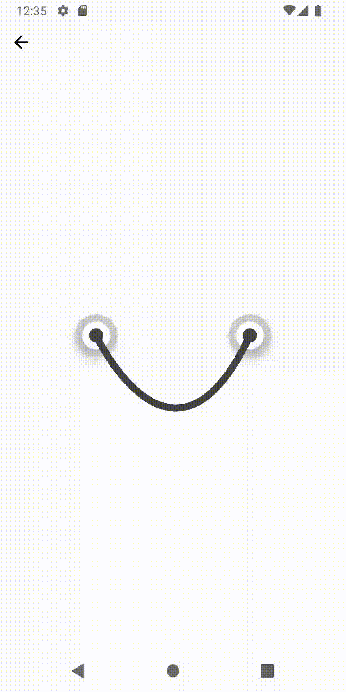

# Jetpack Compose Lab

This repository contains a collection of Jetpack Compose samples, widgets, animations and more.

For more information, refer to [Jetpack Compose documentation.](https://developer.android.com/jetpack/compose)

## 📱 Demo
You can try out the sample app from the releases page. [Download here.](https://github.com/fabirt/jetpack-compose-lab/releases/download/v1.0.0/composelab-release-v1.0.0.apk)

## 🧬 Samples

| Sample  |   |
|:--|--:|
|   **Honeycomb Menu**   A honeycomb collapsible menu.   • Animatable • Transitions • Custom shapes   **[> Browse](app/src/main/java/dev/fabirt/composelab/ui/screen/sample/HoneycombMenuSampleScreen.kt)**   |  |
|  |  |
|   **Compass Animation**   It uses a canvas to draw custom paths and create a compass, whose needle animates infinitely.  • Canvas • Animation • Infinite transition • Easing    **[> Browse](app/src/main/java/dev/fabirt/composelab/ui/screen/sample/CompassSampleScreen.kt)**   |  |
|  |  |
|   **Rope drag and drop**   Simulate a basic rope physics.  • Gestures • Drag & Drop • Canvas • Spring transition    **[> Browse](app/src/main/java/dev/fabirt/composelab/ui/screen/sample/RopePhysicsSampleScreen.kt)**   |  |
